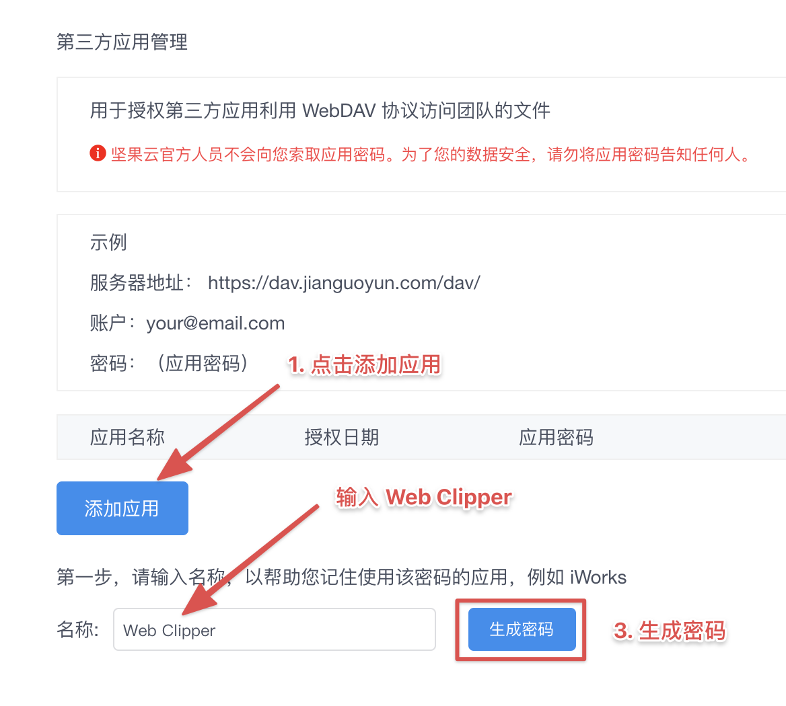

# WebDAV

WebDAV 是免费的，如果你看到收费的提示，请更新的 1.29.0 版本。
因为精力有限，我只验证了[坚果云](https://www.jianguoyun.com), 如果你使用的平台不支持，欢迎去 GitHub 提交 issus.

## 坚果云

> 你需要先注册一个[坚果云](https://www.jianguoyun.com) 的账户。

### 1. 生成专属密码

打开 [安全选项](https://www.jianguoyun.com/#/safety) 页面 ，按照图片的指示生成密码。

