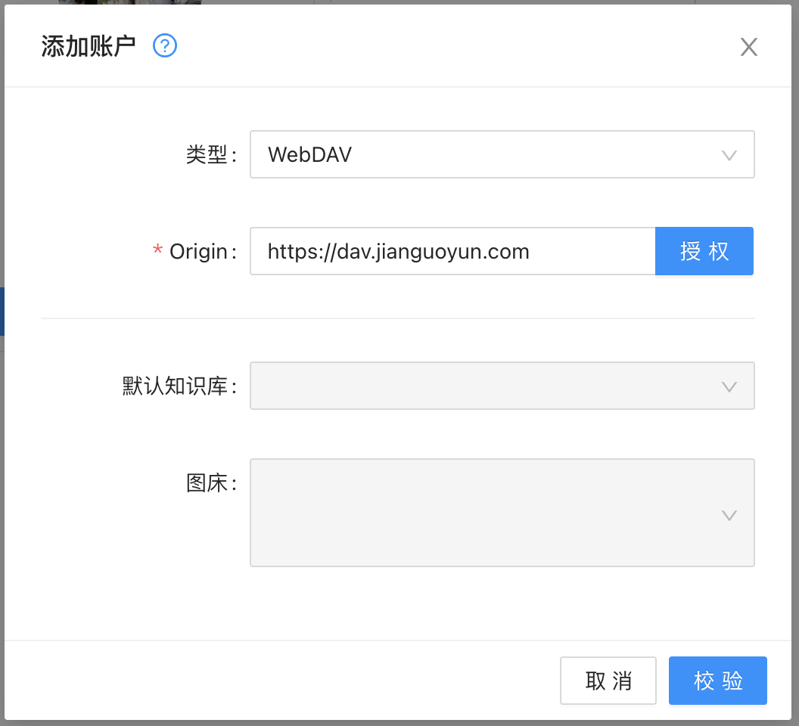
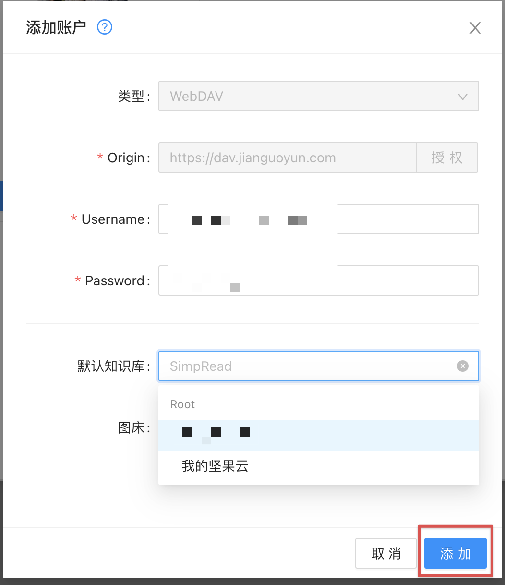

# WebDAV

WebDAV 是免费的，如果你看到收费的提示，请更新的 1.29.0 版本。
因为精力有限，我只验证了[坚果云](https://www.jianguoyun.com), 如果你使用的平台不支持，欢迎去 GitHub 提交 issus.

## 坚果云

> 你需要先注册一个[坚果云](https://www.jianguoyun.com) 的账户。

### 1. 生成专属密码

打开 [安全选项](https://www.jianguoyun.com/#/safety) 页面 ，按照图片的指示生成密码。

生成密码后复制密码、注意不要把密码告知任何人。

### 打开 Web Clipper 点击绑定

首先输入 `https://dav.jianguoyun.com` 进行授权

在 `Username` 和 `password` 分别输入坚果云邮箱，以及上一步创建的密码。

1. 点击校验可以获取到坚果云的文件夹

2. 在默认知识库里选择需要储存的位置

3. 最后点击添加即可使用
